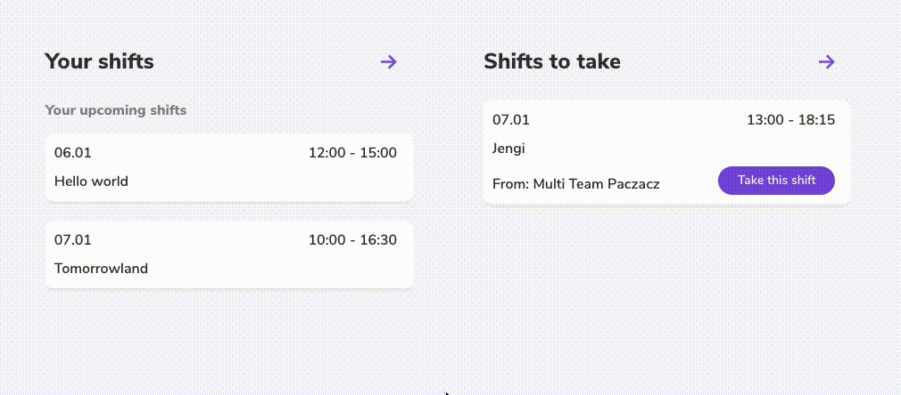

# react-use-callback-sync

- [The problem](#the-problem)
- [The solution](#the-solution)
- [Installation](#installation)
- [Usage](#usage)

## The problem

In some scenarios, you may want to synchronize some actions around the page. Sometimes these are rather unrelated or you don't want to create too big, shared state handlers.

## The solution

This library let's you loosely connect pieces around the application and trigger all of them once one of them is triggered. For example, you may want to trigger data fetching once one button is clicked in a few places around your page.

In the following example, "Your shifts" are updated once you click "Take this shifts" on the right.



## Installation

NPM:

```
npm install react-use-callback-sync
```

or Yarn:

```
yarn add react-use-callback-sync
```

## Usage

### Context provider

First, you need to use `CallbackSyncProvider` somewhere in your application. This initializes the React context. For example, in `App.js`:

```jsx
import { CallbackSyncProvider } from 'react-use-callback-sync';

function App() {
  return (
    <div className="App">
      <CallbackSyncProvider>{/* ... */}</CallbackSyncProvider>
    </div>
  );
}
```

### Basic usage

Then, whenever you want to make your action/handler/etc synced with other ones, use `useCallbackSync` in the following way:

```jsx
import { useCallbackSync } from 'react-use-callback-sync';

function DataWrapper({ onDataFetch }) {
  const [data, setData] = useState({});
  const fetchData = useCallback(async () => {
    const response = await onDataFetch();
    setData(response.data);
  }, [onDataFetch, setData]);

  const fetchAndSync = useCallbackSync({ callback: fetchData });

  return (
    <div>
      <div>{/* data */}</div>
      <button onClick={fetchAndSync}>Refresh</button>
    </div>
  );
}
```

Now, if you have several `DataWrapper` components around, clicking on any "Refresh" would trigger all other `DataWrappers` to fetch the data again. Of course, it's possible to use `useCallbackSync` across different components.

### Group usage

If you need to trigged only some of the actions, you can use `group` parameter for `useCallbackSync`:

```jsx
function ComponentA() {
  const handleClick = useCallback(() => {
    console.log('Clicked!');
  }, []);
  const syncedClick = useCallbackSync({
    group: 'AC/DC',
    callback: handleClick,
  });

  return <button onClick={syncedClick}>Click</button>;
}

function ComponentB() {
  const handleClick = useCallback(() => {
    window.alert('Clicked!');
  }, []);
  const syncedClick = useCallbackSync({
    group: 'Rolling Stones',
    callback: handleClick,
  });

  return <button onClick={syncedClick}>Alert</button>;
}

// In the application:

function Section() {
  return (
    <div>
      <ComponentA />
      <ComponentA />
      <ComponentB />
    </div>
  );
}
```

Now, clicking on either of "Click" buttons from `ComponentA` will trigged console log, but will not trigger an alert from `ComponentB`.
